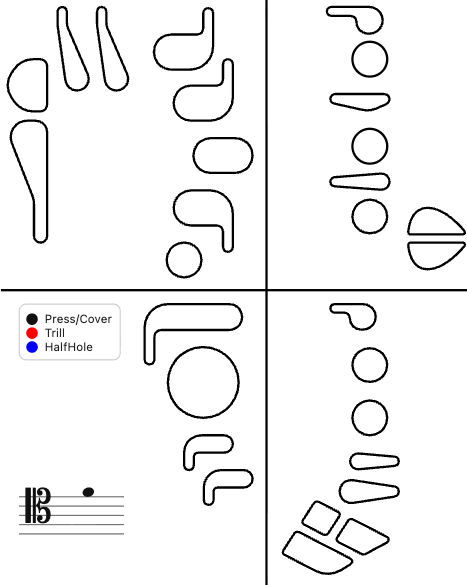

# Bassoon Fingering App

ファゴット(バスーン)の運指(フィンガリング)を記録・シェアするための静的Webアプリ。



## できること

- 運指図(SVG)をタップして色分け(黒=押す、青=半開・特殊、赤=トリル対象キー)
- 音名・トリル音の選択(五線譜オーバーレイに自動反映)
- メモ入力
- PNG画像として保存
- Web Share APIでの画像+テキスト共有

## 使い方

ビルド不要・依存パッケージ無し。`index.html` をブラウザで開くだけで動作する。

```bash
git clone https://github.com/okawahiroto/bassoon-fingering-app.git
cd bassoon-fingering-app
open index.html
```

## テスト

`lib/` 配下の純粋関数(運指state↔URLクエリ文字列の変換など)は、Node標準の `node:test` でテストできる。

```bash
npm test
```

## 構成

| ファイル | 役割 |
| --- | --- |
| `index.html` | 画面全体(音名・トリルのセレクト、Memo/Download/Share ボタン) |
| `app.js` | 全ロジック(状態管理、SVG描画、五線譜オーバーレイ、PNG書き出し、Web Share) |
| `app.css` | スタイル |
| `picture/bassoon_key.svg` | 運指図(全キーに `id` 付与済み。対応は `docs/KEYMAP.md` 参照) |
| `lib/shareUrl.js` | 運指state↔URLクエリ文字列の変換(純関数) |
| `manifest.webmanifest` | PWA設定 |

## 開発ドキュメント

- [`docs/ROADMAP.md`](docs/ROADMAP.md) — 設計判断・データスキーマ・開発計画の詳細リファレンス
- [`docs/KEYMAP.md`](docs/KEYMAP.md) — 運指図SVGのキーID対応表
- 進捗は [GitHub Issues](https://github.com/okawahiroto/bassoon-fingering-app/issues) で管理

## 技術方針

ビルド無し・フレームワーク無しの Vanilla JS 構成を維持する。バンドラやフレームワークの導入は行わない。

## ライセンス

[CC0 1.0 Universal](LICENSE)(パブリックドメイン)
